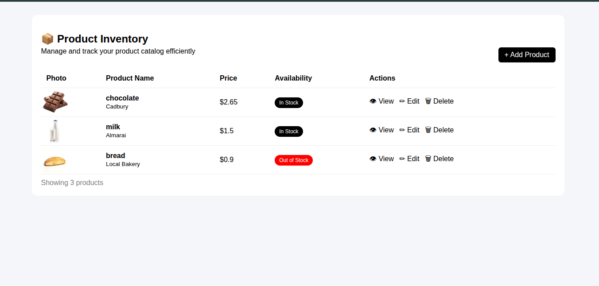
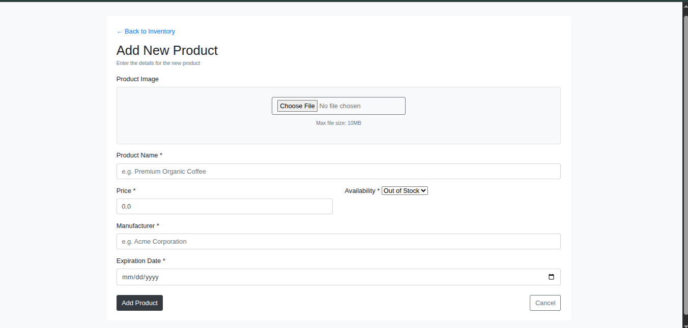
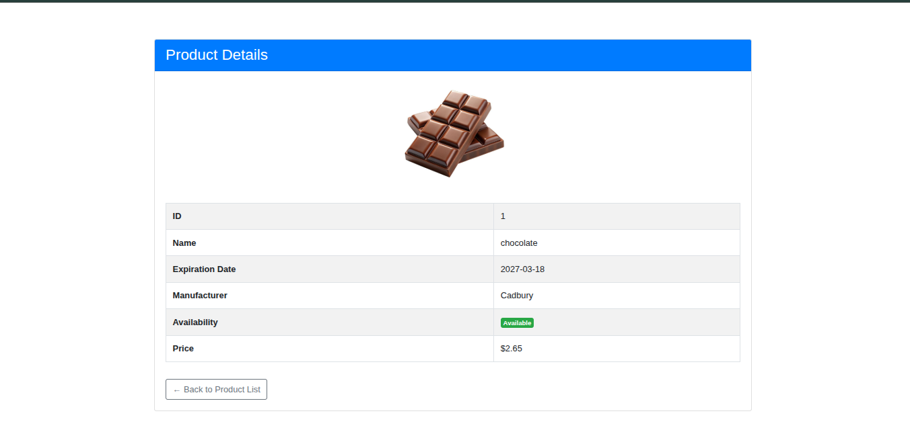

# spring-ecommerce-app

A simple **Spring MVC + Hibernate** web application for managing products (CRUD operations), built using **JSP, Bootstrap, and Apache Tomcat**.


##  Features

*  Add new products
*  Update existing products
*  Delete products
*  View product details
*  Upload product images
*  Form validation with Hibernate Validator
*  Clean MVC architecture

##  Tech Stack

* **Backend:** Spring MVC, Hibernate ORM
* **Frontend:** JSP, JSTL, Bootstrap
* **Database:** MySQL
* **Server:** Apache Tomcat
* **Build Tool:** Maven

## Architecture Overview

This project follows the standard **MVC layered architecture**:

- **Controller Layer** → Handles HTTP requests and responses  
- **Service Layer** → Contains business logic  
- **DAO Layer** → Interacts with the database using Hibernate  
- **View Layer (JSP)** → Displays UI using Bootstrap  

This separation improves maintainability, scalability, and testability.

##  Screenshots

###  Product Inventory (List View)

Displays all products with price, availability, and actions.

<p align="center">
  
</p>

###  Add New Product

Form to create a new product with validation and image upload.

<p align="center">
  
</p>

###  Product Details

Detailed view of a single product including image and metadata.

<p align="center">
  
</p>

##  Project Structure

```
spring-ecommerce-app/
│
├── database/
│   └── sql_script.sql              # Database schema & initial data
│
├── docs/
│   └── images/
│       ├── product-list.png
│       ├── add-product.png
│       └── product-details.png
│
├── src/
│   └── main/
│       ├── java/com.adminPanel.app/
│       │
│       │   ├── config/
│       │   │   ├── HibernateConfig.java   # Hibernate & DB configuration
│       │   │   └── WebConfig.java         # Spring MVC configuration
│       │
│       │   ├── controller/
│       │   │   └── ProductController.java # Handles HTTP requests
│       │
│       │   ├── dao/
│       │   │   ├── ProductDao.java        # DAO interface
│       │   │   └── ProductDaoImpl.java    # DAO implementation
│       │
│       │   ├── entity/
│       │   │   ├── Product.java           # Main product entity
│       │   │   └── ProductDetails.java    # Extra product details (One-to-One)
│       │
│       │   ├── service/
│       │   │   ├── ProductService.java    # Service interface
│       │   │   └── ProductServiceImpl.java# Business logic layer
│       │
│       ├── resources/
│       │   └── app.properties             # App configuration (DB, Hibernate)
│       │
│       └── webapp/
│           ├── resources/
│           │   ├── css/
│           │   │   ├── bootstrap.min.css
│           │   │   └── style.css
│           │   │
│           │   ├── js/
│           │   │   └── bootstrap.bundle.min.js
│           │   │
│           │   └── images/               # Product images
│           │
│           ├── WEB-INF/
│           │   └── view/
│           │       ├── product-form.jsp  # Add/Edit form
│           │       ├── product-list.jsp  # List all products
│           │       └── product-view.jsp  # Product details page
│           │
│           └── web.xml                   # DispatcherServlet config
│
└── pom.xml                              # Maven dependencies
```
## Setup & Installation

### Clone the Repository

```bash
git clone https://github.com/abdelrahmanelhabal/spring-ecommerce-app.git
cd spring-ecommerce-app
```

### Configure the Database

1. **Create a MySQL Database**
   Open your MySQL client and run:

   ```sql
   CREATE DATABASE spring_ecommerce_db;
   ```

2. **Initialize the Database Schema**
   Execute the SQL script included in the repository:

   ```bash
   mysql -u root -p spring_ecommerce_db < database/sql_script.sql
   ```

### Update Database Credentials

Open the configuration file:

```
src/main/resources/app.properties
```

Update the following properties with your database credentials:

```properties
db.url=jdbc:mysql://localhost:3306/spring_ecommerce_db
db.username=root
db.password=your_password
```

> Tip: Make sure the database user has the necessary privileges to read/write.


### Build the Project

Use Maven to compile and package the project:

```bash
mvn clean install
```

This will generate a `.war` file in the `target/` directory.

### Deploy to Apache Tomcat

1. Copy the generated `.war` file to Tomcat’s `webapps/` directory.
2. Start the Tomcat server:

```bash
catalina.sh start   # Linux / Mac
startup.bat         # Windows
```

3. Verify deployment in the Tomcat manager or logs.

### Access the Application

Open your browser and navigate to:

```
http://localhost:8080/spring-ecommerce-app/products
```

You should see the product listing page of the application.

## Pages Overview

* **Product List** → Displays all products in a table with actions (View, Edit, Delete).
* **Add / Edit Product** → Single form used for both adding a new product and updating an existing one. Includes validation for required fields, numeric values, and dates.
* **View Product** → Shows detailed information for a single product, including images and description.

>  Tip: The form dynamically adapts based on the context:
>
> * **Add Product**: Empty fields for creating a new product.
> * **Edit Product**: Pre-populated fields with existing product data for editing.
