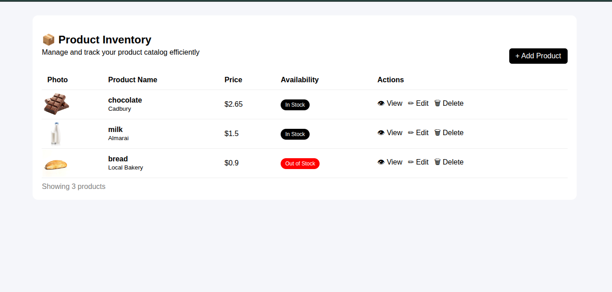
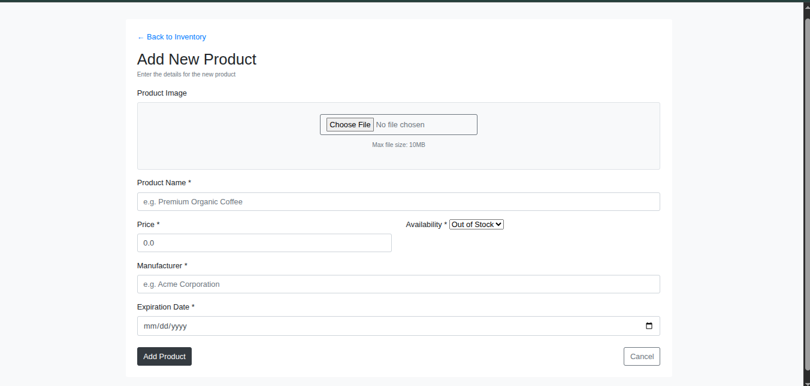
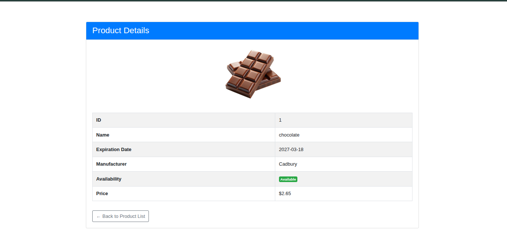

# Spring E-Commerce App

<p align="center">
  
</p>

<p align="center">


</p>

---

# Overview

Spring E-Commerce App is a production-ready Java web application built using **Spring MVC**, **Hibernate ORM**, **JSP**, and **MySQL**.

The application allows administrators to manage products through a complete CRUD interface while following a clean layered MVC architecture.

The project is fully containerized using Docker, orchestrated with Docker Compose, automatically deployed using GitHub Actions, and hosted on AWS EC2.

---

# Features

- Product Management (CRUD)
- Product Details
- Product Image Upload
- Hibernate Validation
- Responsive Bootstrap UI
- Layered MVC Architecture
- Dockerized Application
- Docker Compose Multi-Container Setup
- Automated CI/CD Pipeline
- AWS EC2 Deployment
- Environment Variable Configuration

---

## Tech Stack

* **Programming Language:** Java 17
* **Backend:** Spring MVC, Hibernate ORM
* **Frontend:** JSP, CSS , Bootstrap 5
* **Database:** MySQL 8
* **Server:** Apache Tomcat 10
* **Build Tool:** Maven
* **Containerization:** Docker, Docker Compose
* **CI/CD:** GitHub Actions
* **Cloud Platform:** AWS EC2
* **Container Registry:** Docker Hub
* **Version Control:** Git & GitHub

---

## Architecture Overview

This project follows the standard **MVC layered architecture**:

- **Controller Layer** → Handles HTTP requests and responses 
- **Service Layer** → Contains business logic 
- **DAO Layer** → Interacts with the database using Hibernate 
- **View Layer (JSP)** → Displays UI using Bootstrap 

This separation improves maintainability, scalability, and testability.

---

## Deployment Architecture

This project follows a modern **CI/CD deployment architecture**:

- **GitHub Repository** → Stores the application source code and Docker configuration.
- **GitHub Actions** → Automatically builds, packages, and deploys the application whenever changes are pushed to the `main` branch.
- **Docker Hub** → Hosts the versioned Docker image built by the CI/CD pipeline.
- **AWS EC2** → Hosts the Dockerized Spring MVC application in the production environment.
- **Docker Compose** → Manages the application container lifecycle on the EC2 instance.
- **Apache Tomcat Container** → Runs the packaged Spring MVC application (`WAR` file).
- **Amazon RDS (MySQL)** → Provides a managed MySQL database service for persistent data storage, securely connected to the application running on AWS EC2.

This deployment pipeline enables automated builds, consistent deployments, containerized execution, and reliable production updates.

---

##  Screenshots

###  Product Inventory (List View)

Displays all products with price, availability, and actions.

<p align="center">
  
</p>

###  Add New Product

Form to create a new product with validation and image upload.

<p align="center">
  
</p>

###  Product Details

Detailed view of a single product including image and metadata.

<p align="center">
  
</p>

---

## Project Structure

```
spring-ecommerce-app/
│
├── .github/
│   └── workflows/
│       └── deploy.yml                 # GitHub Actions CI/CD pipeline
│
├── database/
│   └── sql_script.sql                 # Database schema & initial data
│
├── src/
│   └── main/
│       ├── java/com.adminPanel.app/
│       │
│       │   ├── config/
│       │   │   ├── HibernateConfig.java    # Hibernate & DB configuration
│       │   │   └── WebConfig.java          # Spring MVC configuration
│       │   │
│       │   ├── controller/
│       │   │   └── ProductController.java  # Handles HTTP requests
│       │   │
│       │   ├── dao/
│       │   │   ├── ProductDao.java         # DAO interface
│       │   │   └── ProductDaoImpl.java     # DAO implementation
│       │   │
│       │   ├── entity/
│       │   │   ├── Product.java            # Product entity
│       │   │   └── ProductDetails.java     # Product details entity
│       │   │
│       │   └── service/
│       │       ├── ProductService.java     # Service interface
│       │       └── ProductServiceImpl.java # Business logic
│       │
│       └── webapp/
│           ├── resources/
│           │   ├── css/
│           │   │   ├── bootstrap.min.css
│           │   │   └── style.css
│           │   │
│           │   ├── js/
│           │   │   └── bootstrap.bundle.min.js
│           │   │
│           │   └── images/                 # Uploaded product images
│           │
│           ├── WEB-INF/
│           │   └── view/
│           │       ├── product-form.jsp
│           │       ├── product-list.jsp
│           │       └── product-view.jsp
│           │
│           └── web.xml                     # DispatcherServlet configuration
│
├── Dockerfile                             # Builds the application Docker image
├── docker-compose.yml                     # Defines the production container
├── .dockerignore                          # Docker build exclusions
│
├── pom.xml                                # Maven dependencies
└── README.md
```

---

## CI/CD Pipeline

The project uses **GitHub Actions** to automate the deployment process. The workflow is **manually triggered** using **`workflow_dispatch`**, allowing deployments to be performed only when a new release is ready.

### Pipeline Steps

1. Checkout the latest source code from the repository.
2. Authenticate with Docker Hub using GitHub Secrets.
3. Build the Docker image for the Spring MVC application.
4. Push the Docker image to Docker Hub.
5. Configure SSH access to the AWS EC2 instance.
6. Connect to the EC2 instance via SSH.
7. Pull the latest Docker image using Docker Compose.
8. Recreate and restart the application container.
9. Remove unused Docker images to free disk space.

This manual deployment workflow provides controlled, repeatable, and reliable deployments while ensuring the production server always runs the latest application image.

---
# Getting Started

Follow these steps to run the project on your local machine.

## Prerequisites

Make sure you have the following installed:

* Git
* Docker
* Docker Compose

---

## 1. Clone the Repository

```bash
git clone https://github.com/abdelrahmanelhabal/spring-ecommerce-app.git
cd spring-ecommerce-app
```

---

## 2. Configure Environment Variables

Create a `.env` file in the project root with the following configuration:

```env
# Database Connection
hibernate.connection.driver_class=com.mysql.cj.jdbc.Driver
hibernate.connection.url=jdbc:mysql://<YOUR_DATABASE_HOST>:3306/<YOUR_DATABASE_NAME>?useSSL=false&serverTimezone=UTC&allowPublicKeyRetrieval=true
hibernate.connection.username=<YOUR_DATABASE_USERNAME>
hibernate.connection.password=<YOUR_DATABASE_PASSWORD>

# Hibernate Configuration
hibernate.dialect=org.hibernate.dialect.MySQL8Dialect
hibernate.show_sql=true
hibernate.hbm2ddl.auto=update
hibernate.current_session_context_class=org.springframework.orm.hibernate5.SpringSessionContext
```

Replace the placeholder values with your own database credentials.

> **Example**
>
> ```env
> hibernate.connection.driver_class=com.mysql.cj.jdbc.Driver
> hibernate.connection.url=jdbc:mysql://your-rds-endpoint.amazonaws.com:3306/ProductDB?useSSL=false&serverTimezone=UTC&allowPublicKeyRetrieval=true
> hibernate.connection.username=admin
> hibernate.connection.password=your_password
>
> hibernate.dialect=org.hibernate.dialect.MySQL8Dialect
> hibernate.show_sql=true
> hibernate.hbm2ddl.auto=update
> hibernate.current_session_context_class=org.springframework.orm.hibernate5.SpringSessionContext
> ```

> **Important**
>
> * Never commit your `.env` file to version control.
> * Ensure your MySQL database is running and accessible before starting the application.
> * If you're using Amazon RDS or another cloud-hosted MySQL database, make sure it accepts connections from your machine.

---

## 3. Initialize the Database

Create the database:

```sql
CREATE DATABASE ProductDB;
```

Import the SQL script:

```bash
mysql -u <username> -p ProductDB < database/sql_script.sql
```

---

## 4. (Optional) Build and Push Your Own Docker Image

If you make changes to the application source code, you'll need to build a new Docker image and push it to your Docker Hub account.

### Build the Docker Image

From the project root, run:

```bash
docker build -t <your-dockerhub-username>/spring-mvc-app:latest .
```

### Log in to Docker Hub

```bash
docker login
```

Enter your Docker Hub username and password when prompted.

### Push the Image

```bash
docker push <your-dockerhub-username>/spring-mvc-app:latest
```

Once the image has been pushed successfully, update the `image` field in your `docker-compose.yml` file to point to your Docker Hub repository.

---

## 5. Configure Docker Compose

Open the `docker-compose.yml` file and update the `image` field with the Docker image you want to use.

For example:

```yaml
version: "3.8"

services:
  app:
    image: <your-dockerhub-username>/spring-mvc-app:latest
    container_name: spring_mvc_app
    ports:
      - "8080:8080"
    env_file:
      - .env
```

After updating the image name, save the file and continue with the next step.

---

## 6. Start the Application

Pull the latest image (optional but recommended):

```bash
docker compose pull
```

Start the container:

```bash
docker compose up -d
```

Stop the container:

```bash
docker compose down
```

View application logs:

```bash
docker compose logs -f app
```

---

## 6. Access the Application

Once the container is running, open your browser and visit:

```
http://localhost:8080/spring-ecommerce-app/products
```

If you're running the container on a remote server (such as AWS EC2), replace `localhost` with your server's public IP or domain name:

```
http://<SERVER_IP>:8080/spring-ecommerce-app/products
```
